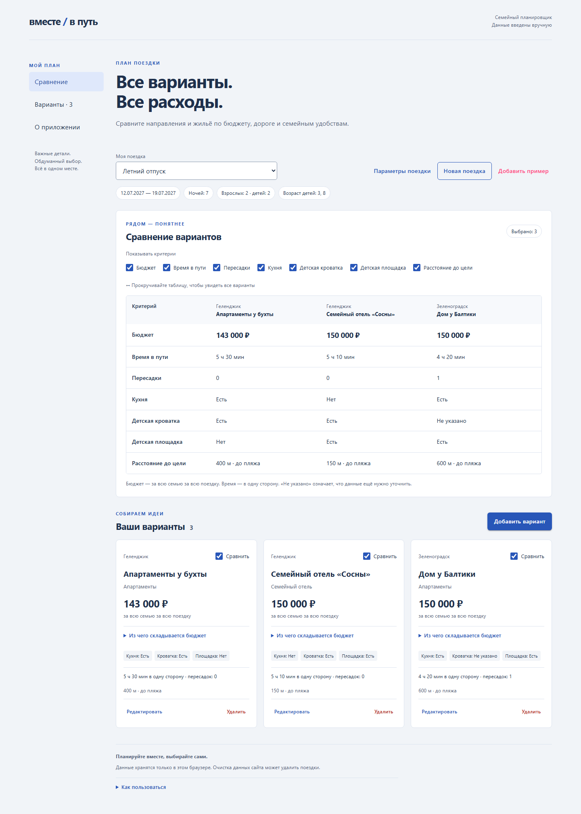

# Вместе в путь

Адаптивное приложение для сравнения семейных поездок по бюджету, дороге и удобствам для детей.
Домашнее задание №4: реализация frontend с AI-агентом по [ТЗ из ДЗ 3](docs/technical_specification.md).

## Возможности

- Несколько независимых поездок: даты, ночи, взрослые и возраст детей.
- Создание, редактирование и удаление вариантов направления и жилья.
- Шесть статей бюджета в рублях за всю семью за всю поездку. Расчёт в целых копейках; пустое значение отличается от нуля.
- Сравнение двух и более вариантов по семи переключаемым критериям.
- Пометка проверки расходов при изменении дат или семьи.
- Локальное сохранение в IndexedDB, обработка ошибок записи и конфликтов вкладок.

Основной экран следует концепции [«План поездки»](docs/ui_concepts/03-analytical.html): сине-серая палитра, сравнение перед карточками, боковая навигация на широком экране.



## Стек

C# / .NET 10, **Blazor WebAssembly Standalone**, **MudBlazor 9.7.0**.
Бизнес-правила и валидация — C#; IndexedDB и управление фокусом — небольшие JS-модули.
Тесты: xUnit, bUnit, Playwright .NET.

Серверного API данных нет. Приложение выполняется в браузере; локальные операции продолжают работать без сети после загрузки ресурсов.

## Запуск

Нужен .NET SDK **10.0.302** или более новый patch из той же линии (см. global.json).
Node.js и npm для сборки и запуска не нужны.

Из корня репозитория:

```powershell
dotnet restore Together.slnx --locked-mode
dotnet run --project src/Together.Client
```

Откройте **http://localhost:5180**. В пустом профиле браузера приложение создаёт
вымышленную демонстрационную поездку с тремя вариантами. Если в IndexedDB уже есть
поездки, они не перезаписываются; пример можно добавить кнопкой «Добавить пример».

Для разработки с hot reload:

```powershell
dotnet watch --project src/Together.Client
```

Сохраняйте один адрес и порт: браузер разделяет данные localhost и 127.0.0.1, а также разных портов.


## Проверки

```powershell
dotnet build Together.slnx -c Release
dotnet test tests/Together.Tests -c Release
dotnet run --project tests/Together.BrowserTests -- --install
```

Установщик загружает отдельные Chromium и Firefox для автоматических тестов.

При работающем приложении на localhost:5180 запустите в другом терминале:

```powershell
dotnet run --project tests/Together.BrowserTests
```

Браузерные тесты создают изолированные профили, используют вымышленные данные,
проверяют оба движка и возвращают ненулевой код при ошибке.
Не запускайте несколько копий набора одновременно: они записывают одни и те же файлы отчёта.

Результаты и скриншоты: [docs/evidence](docs/evidence/).
Итог: 32 модульных/компонентных теста и 22 браузерных сценария прошли; Release-сборка и публикация успешны.
Описание проверок, найденных дефектов и ограничений: [development_report.md](development_report.md).

Дополнительные команды в PowerShell:

```powershell
# Только отдельные сценарии:
$env:TEST_FILTER = 'keyboard,storage-failure'
dotnet run --project tests/Together.BrowserTests
Remove-Item Env:TEST_FILTER

# Проверка CSS hot reload; в первом терминале должен работать dotnet watch:
dotnet run --project tests/Together.BrowserTests -- --hot-reload
```

## Сборка для размещения

```powershell
dotnet publish src/Together.Client -c Release -o artifacts/publish
```

Результат — статические файлы в artifacts/publish/wwwroot. Для размещения нужен HTTP(S)-хостинг с поддержкой MIME application/wasm.
Сборка не требует wasm-tools; без этой необязательной нагрузки SDK сообщает о пропуске дополнительных оптимизаций WebAssembly.

Для локальной проверки опубликованных файлов предусмотрен **тестовый** статический сервер:

```powershell
dotnet run --project tests/Together.BrowserTests -- --serve-published
```

Откройте http://localhost:5181. Для браузерной проверки этой сборки в отдельном терминале:

```powershell
$env:APP_URL = 'http://localhost:5181'
dotnet run --project tests/Together.BrowserTests --no-build
Remove-Item Env:APP_URL
```

## Структура

| Путь | Назначение |
| --- | --- |
| src/Together.Core | Модель, календарные расчёты, бюджет и валидация |
| src/Together.Client/Components | Формы, таблица, карточки и общие элементы |
| src/Together.Client/Pages | Основной экран и управление сохранением |
| src/Together.Client/Storage | Адаптер IndexedDB |
| src/Together.Client/wwwroot/js | Транзакции и управление диалогом |
| tests/Together.Tests | Модульные и компонентные тесты |
| tests/Together.BrowserTests | Сценарии двух браузеров, mock-данные, измерения, статический preview |
| docs | Исходное ТЗ, концепции, план и доказательства проверок |

Зависимости закреплены в .csproj и packages.lock.json.
package.json включён как дополнительная точка входа для команд из формата задания; npm-зависимостей у приложения нет.

## Хранение и границы MVP

**Данные хранятся только в этом браузере. Очистка данных сайта может удалить поездки.**
Регистрации, синхронизации, импорта цен, бронирования и конвертации валют нет.
Копирование, сортировка и отметка выбора семьи отложены согласно ТЗ.

IndexedDB содержит версионированный снимок поездок. Смена варианта, удаление и очистка выбора происходят в одной транзакции.
Запись проверяет версии снимка и изменяемой поездки. Другая вкладка может вызвать конфликт даже при работе с другой поездкой; приложение предлагает загрузить актуальные данные и сохраняет черновик до подтверждения.
Повреждённые или несовместимые записи не очищаются автоматически.

Приложение не обещает офлайн-перезапуск: для первоначальной загрузки страницы может понадобиться сеть.
Тестовый статический сервер не входит в приложение и не содержит API поездок.

## Материалы для сдачи

- [Готовый текст и чек-лист сдачи](SUBMISSION.md)
- [Отчёт о разработке](development_report.md)
- [Статус восьми шагов](docs/homework_progress.md)
- [Адаптированные промпт-шаблоны ДЗ 2](docs/prompt_templates.md)
- [Правила работы агента](AGENTS.md)
- [Результаты браузерных тестов](docs/evidence/browser-results.json)
- [Измерения производительности](docs/evidence/performance.json)

Материалы подготовлены для сдачи. Пользователь самостоятельно публикует репозиторий на GitHub и предоставляет его ссылку.

## Использованная документация

- [Встроенные шаблоны .NET, включая blazorwasm](https://learn.microsoft.com/en-us/dotnet/core/tools/dotnet-new-sdk-templates)
- [MudBlazor: установка](https://mudblazor.com/getting-started/installation)
- [Playwright .NET: установка и запуск](https://playwright.dev/dotnet/docs/intro)
